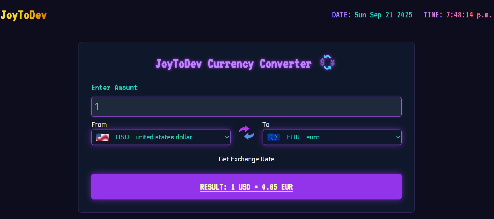

# 💱 Currency Converter

A modern currency converter built with **React**, **Vite**, and **Tailwind CSS**, using the [ExchangeRate API](https://www.exchangerate-api.com/) for real-time exchange rates and [Flagpedia](https://flagpedia.net/the-united-kingdom/download/api) for country flags.  

This project is inspired by [CodingNepal’s React Currency Converter tutorial](https://www.codingnepalweb.com/build-currency-converter-project-reactjs/#google_vignette) but enhanced with Tailwind styling and Vite’s fast development setup.

---

## Live Demo
## [Live Demo🚀🎉](https://www.joytodev.com/projects/currencyConverter)

<p align="center">
  
</p>

## 🚀 Features
- Convert between **over 150 currencies** with live exchange rates  
- Beautiful **country flag display** for selected currencies  
- **Responsive design** powered by Tailwind CSS  
- Clean, modular React components  
- Fast builds and hot reloading with Vite  

---

## 🛠️ Tech Stack
- [React](https://react.dev/) – UI components  
- [Vite](https://vite.dev/) – Build tool & dev server  
- [Tailwind CSS](https://tailwindcss.com/) – Utility-first CSS framework  
- [ExchangeRate API](https://www.exchangerate-api.com/) – Currency conversion rates  
- [Flagpedia API](https://flagpedia.net/) – Currency/country flags  

---

## ⚙️ Setup Instructions

### 1. Clone the repository
```bash
git clone https://github.com/your-username/currency-converter.git
cd currency-converter
```

### 2. Install dependencies
``` bash
npm install
```

### 3. Configure Tailwind CSS
Make sure your `tailwind.config.js` looks like this:
``` javascript
/** @type {import('tailwindcss').Config} */
export default {
  content: [
    "./src/**/*.{js,jsx,ts,tsx}",
  ],
  theme: {
    extend: {},
  },
  plugins: [],
}
```

Update `vite.config.js` to include Tailwind:
```javascript
import { defineConfig } from "vite";
import react from "@vitejs/plugin-react";
import tailwindcss from "@tailwindcss/vite";

// https://vite.dev/config/
export default defineConfig({
  plugins: [react(), tailwindcss()],
});

```

### 4. Add environment variables
Create a `.env` file in the project root:
```bash
VITE_EXCHANGE_API_KEY=your_api_key_here
```
👉 Get your API key from [ExchangeRate API](https://www.exchangerate-api.com)

### 5. Run the development server
```bash
npm run dev
```

#### Now open `http://localhost:5173` in your browser 🎉

### 📂 Project Structure
src/
 - components/    # Reusable UI components
 - data/          # currency information JSON
 - App.jsx        # Main application entry
 - main.jsx       # ReactDOM render
 - index.css      # Tailwind styles


### 🔮 Future Improvements

- Add currency search/filter
- Show historical exchange rates with charts
- Offline mode with local storage caching